# newstracker

## Table of Contents
[I. Overview](#technologytools)\
    [- i. Technology/Tools](#technologytools)   
    [- ii. Summary](#summary)  
    [- iii. Purpose](#purpose)  
[II. User Flows](#user-flow)\
    [- i. Non-Users](#non-users)          
    [- ii. Users](#users)\
[III. Data](#data)\
    [- i. Postgresql/Flask-SqlAlchemy](#PostgresqlFlask-SqlAlchemy)  
    [- ii. Flask's Server-Side Session with Redis](#flasks-server-side-session-with-redis)  
    [- iii. News-Api](#News-Api)  
    [- iv. Summary](#summary-1)  
[IV. Challenges/Reflections](#challengesreflections)\
    [- i. Sentimental Analysis Accuracy](#sentimental-analysis-accuracy)\
    [- ii. Limitations of NewsApi's Free Tier](#limitations-of-newsapis-free-tier)\
    [- iii. Storage and State Deliberations: Postgres VS Client-Side Session VS Server-Side Session](#storage-and-state-deliberations-postgres-vs-client-side-session-vs-server-side-session)\
[V. Future Ideas](#futureideas)\
    [- i. Automatic Sentiment Analysis Scores for User Search Queries](#automatic-sentiment-analysis-scores-for-user-search-queries)\
    [- ii. Macro-Analysis](#macro-analysis)\
    [- iii. Integration of Twitter API](#integration-of-twitter-api)\
    [- iv. React.js Front-End](#reactjs-front-end)

    

### Technology/Tools 
Python, Flask, SQLAlchemy, Redis, Postgresql, NewsAPI, NLTK, Textblob, Newspaper, Multiprocessing, Javascript, Axios, WTForms, CSS, Bootstrap.

### Summary 
  NewsTracker is an application designed to enhance and optimize the way a user interacts with news stories. 
  This is achieved primarily using a search engine that connects to [NewsAPI](https://newsapi.org/) which allows the user to narrow-down the content of their results.  
  
  Additional search parameters such as [Polarity](https://www.nltk.org/api/nltk.sentiment.html) and [Subjectivity](https://www.topcoder.com/thrive/articles/getting-started-with-textblob-for-sentiment-analysis#:~:text=Subjectivity%20is%20the%20output%20that,%2C%20WordNet%20integration%2C%20and%20more.) use Natural Language Processing through Python's [NLTK](https://www.nltk.org/) and [Textblob](https://textblob.readthedocs.io/en/dev/) libararies to parse through the html data given by the URL returned by NewsAPI, which will order a user's search results by the degree to which an article is objective or positive, 
 with the corresponding score listed for each article.
  
  Other features available to users include the ability to save stories that they want to refer back to later, save multiple search queries for easy-access through an accordian drop-down, and the ability to set one of said queries as a user's default so that their headline feed will be base its results off that query
  default so that the main headline page will show results based off of the user's default search query. 

### Purpose 
  The ability to run an advanced search query to display a specific type of story and store it permanently in a user's account could be beneficial for 
  anyone wanting to keep up with current events and/or investment opportunities. Getting Sentimental Analysis prior to reading a story has a variety of potential 
  benefits. Imagine the following scenarios:

    1) An investor is trying to assess the pros and cons of owning stock in a particular company. Using the
    subjectivity feature to identify degrees of subjectivity, they may choose to filter out articles that are
    marked as highly subjective, which allows them to save researching time and become better informed.

    2) Someone wanting to become more politically informed about a particular issue may use the subjectivity 
    feature to identify news sources and types of stories that may not be worth reading due to the degree to
    which the author's tone skews from being objective. 

    3) A day/swing trader may want to use the polarity feature to evaluate the overall market sentiment of a
    particular stock, crypto, or geo-political region. 

    4) An individual has been feeling that the amount of negative news they've been consuming has taken a toll
    on their mental health, and want to expose themselves to more positive and uplifting news may use the polarity 
    feature to filter out negative stories. 

 Although there are many different use cases that type of application might provide to its users, as described above, I also think it is important to mention that current NLP Sentiment Analysis capabilities aren't perfect, and a user should not expect to get accurate results or insights 100% of the time. A more thorough analysis of the accuracy of these features and how they might apply to each of the 4 scenarios outlined above can be found under the [Sentimental Analysis Accuracy](#sentimental-analysis-accuracy) section of this ReadMe. 

## User-Flow 
### Non-Users
  The homepage of NewsTracker contains an easily accessible Demo User login button on the top right of the page, which allows a visitor to access the same feautures as a real user. Below are multiple Bootstrap carousels
  containing the top headlines for each category permitted to us by the News Api. Clicking on each story as they pass through the carousel results 
  in said story opening up in a new window, while clicking the category name itself returns a feed of headlines containing the stories displayed in the carousel. 
  
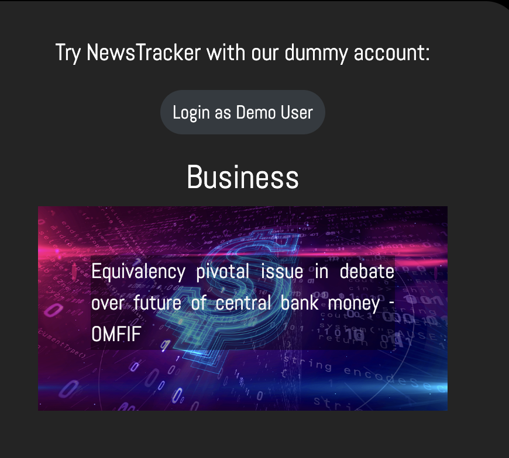
The left side of the page contains cards explaining various features of the app.

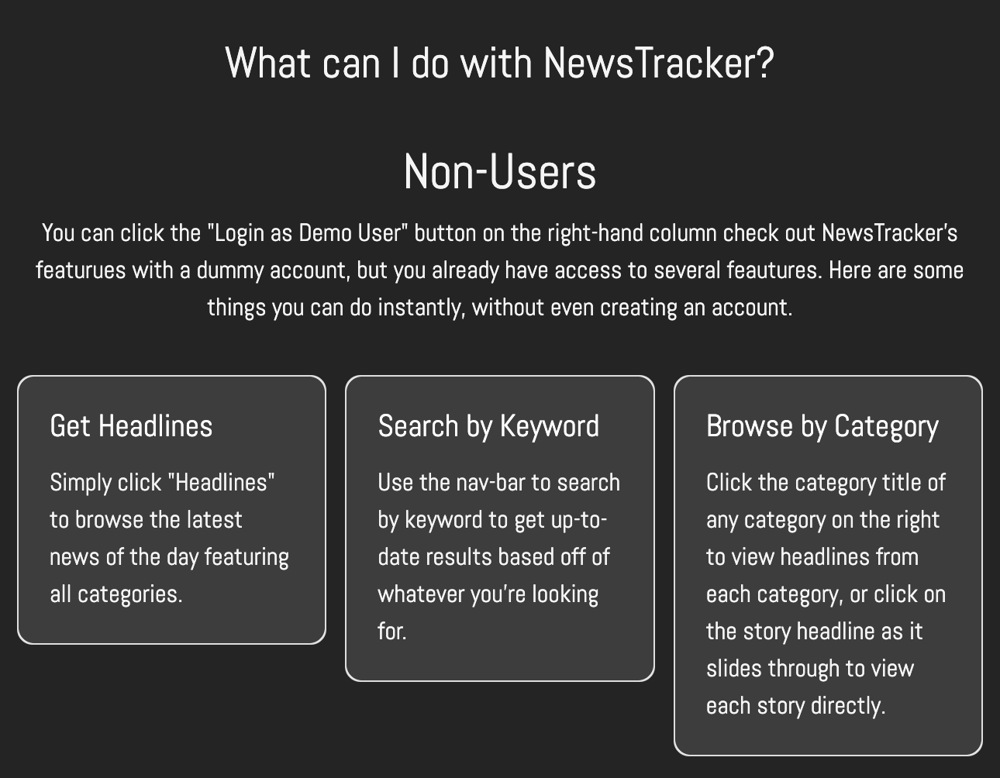
What the navbar looks like for someone that's not logged in to a user account. 

The search bar on the far right allows both non users and users to run a quick search for news stories by keyword. 

If a visitor would like to take advantage of the app's user-feautures and optimize their experience with a resuable account capable of permanently saving news stories and search preferences, they can use the `Register` or `Login` navbar links to create an account or log in. 

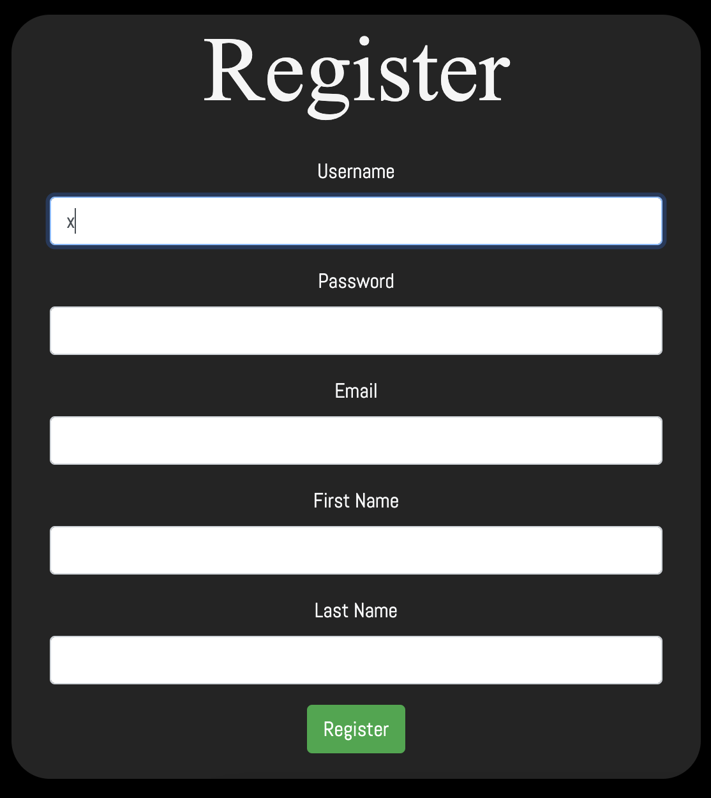
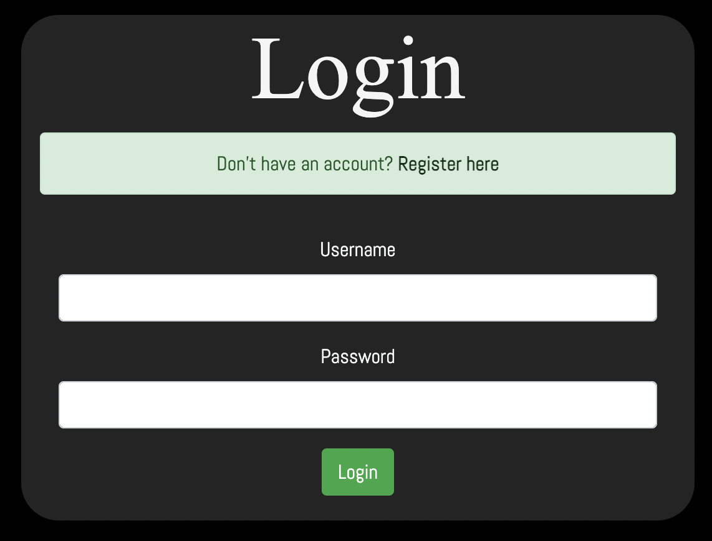

### Users
  After logging in, a user will be redirected to `Headlines` which will either display a feed of general top headlines, or a feed of their results from their default search query, if they have set a default. 
  
  Below is a screenshot from a headlines feed where a user's default query is set to UK, and ordered by polarity. 
  
  

  A user's navbar now contains `Detailed Search`, `My Stories`, and `My Queries`.
  

  

 A user can navigate to `Detailed Search` where they can submit a search query much more specific than the simple search. Parameters that can be specified include `Keyword`, `Source`, `Language`, `Quantity` `Date From`, `Date To`, `Save Search`, `Make Default`, and `Sort By`, where the user has the option to incorporate Sentiment Analysis in the search by ordering by `Subjectivity` or `Polarity`.
 

    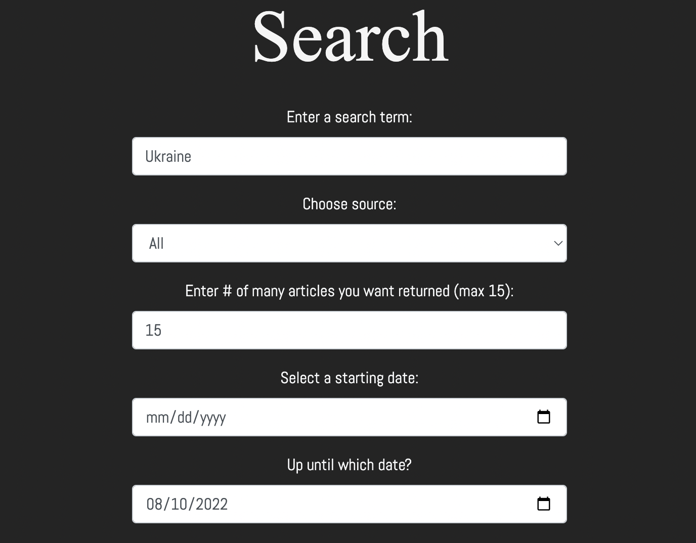
    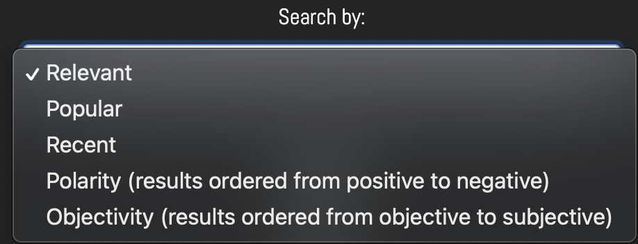

If a user has a particular search query that they'd like to re-use, but they don't want to have to re-enter the same information into the search form each time, they can mark that they want to save the query, then must proceed to give it a name. 
A user can now access and run this particular search query through the drop down menu of `My Queries`.

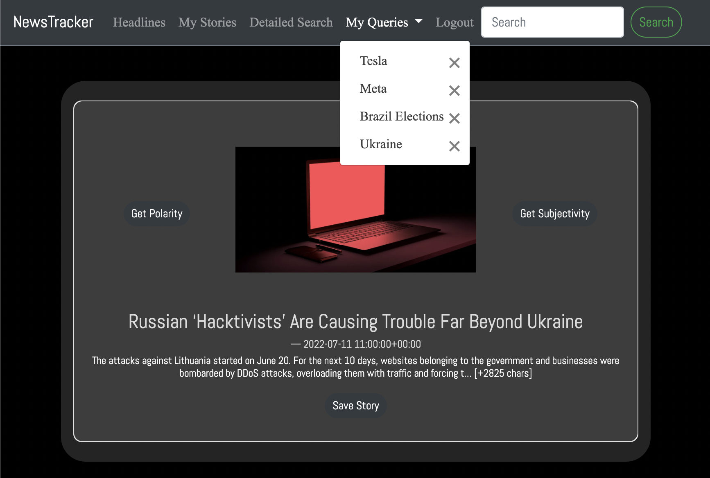

  Along with the option of filtering one's search results by polarity or subjectivity, a user may choose to get such sentimental analysis data on any individual stories
  wherever they are rendered, with the exception of the category-carousels on the home-page. 
 

 
 

## Data 
### Postgresql/Flask-SqlAlchemy

  News Tracker uses a Postgresql database configured through Flask-Sqlalchemy on the backend to store information that we want to persist in our application regardless of the client. When reduced to the absolute minimum amount necessary for the application to work as envisioned, we are left only with information pertaining to a registered user. This is composed of information given by a user upon registration, as well as stories and search queries that they may have saved. In SQL terms, we are left with a simple schema containing 3 tables: `User`, `Story`, and `Query`, where `Story` and `Query` are associated with their respective user by a foreign key in a one-way, one-to-many relationsip.
A diagram of our Postgresql schema is shown below. 

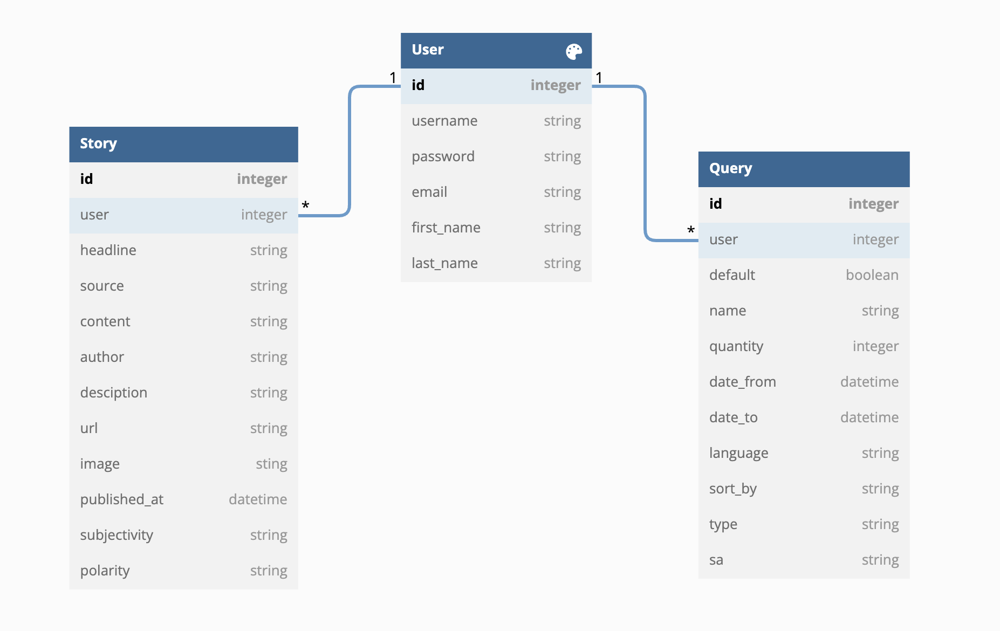

    

### Flask's Server-Side Session with Redis
  Data that doesn't need to persist, in our case being regular search queries and search results that a user does not choose to save, are temporarily stored memory with Flask's Server-Side Session configured through a Redis database. By taking the approach of avoiding using our Postgresql database except when absolutely necessary, we reduce latency and increase overall permformance. A more in depth explanation discussing the trade-offs of using Posgresql, Server Side Session, and Client Side Session for this project can be found [here](#storage-and-state-deliberations-postgres-vs-client-side-session-vs-server-side-session). Below is a basic diagram of how Session is used to temporarily store data.
 
 
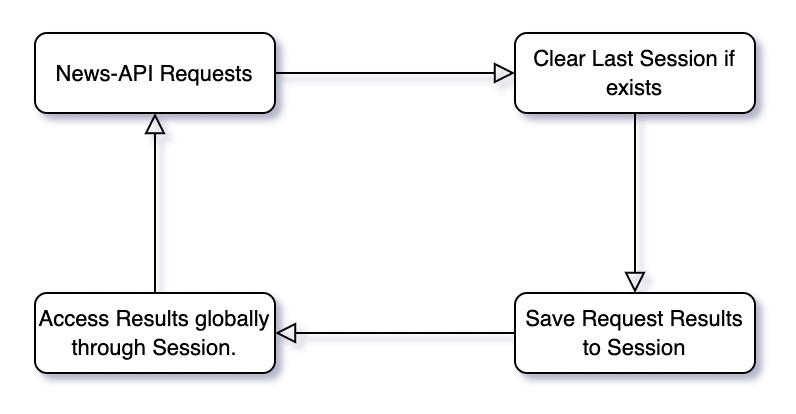

### News-Api
  
Data for individual news stories is sent to Newstracker by either one of the two endpoints NewsApi provides; `Get Top Headlines`, and `Get Everything`. `Get Everything` is the more customizable endpoint, with a sizable amount of different parameters, many of which are utilized in News-Tracker's advanced search. `Get Top Headlines`, on the other hand, only allows language and category as its parameters. Both are used at various points throughout the app. The diagram below illustrates the directional flow of information and data as it travels throughout the application.
  
It's helpful to conceptualize these two endpoints as such that requests generated by user input call the `Get Everything` endpoint (essentially all 'searches') whereas all api requests simply wanting to get the top stories for everything or by category will call the `Get Top Headlines` endpoint. 

Thus, the overall flow of news story data can be concieved of as `NewsApi Results ---> Session Storage ---> Postgresql`, being one-directional and capable of stopping at each point without arriving at the next. An simple illustration representing this process is shown below.
 

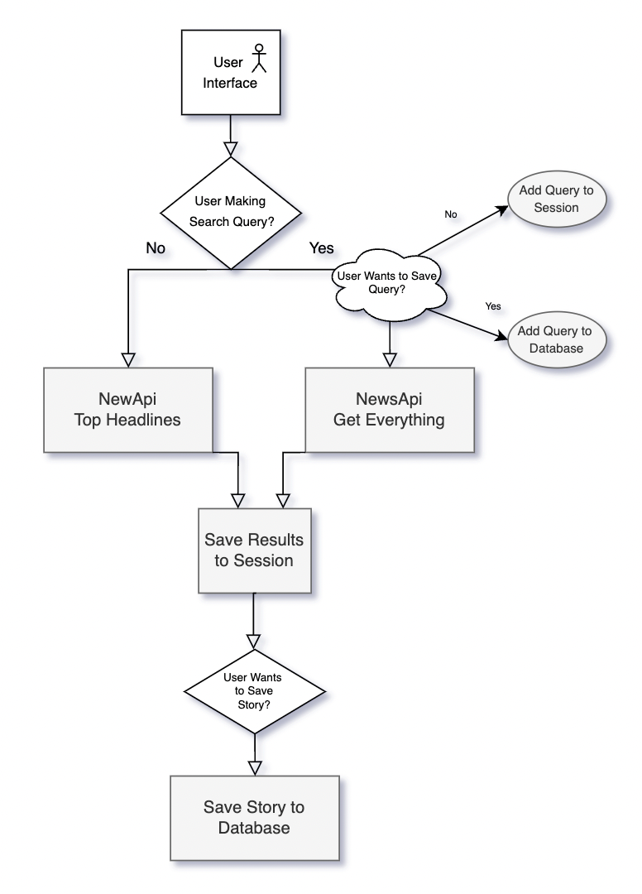

### Summary
Now that we've walked through each step in News Tracker's dataflow, let's combine everything we've covered into a single diagram which gives us a more precise understanding of how data might be accessed throughout the application. While not comprehensive, the following diagram now includes specific routes, instances of API calls, our Sentimental Analysis logic, and Jinja templates.

    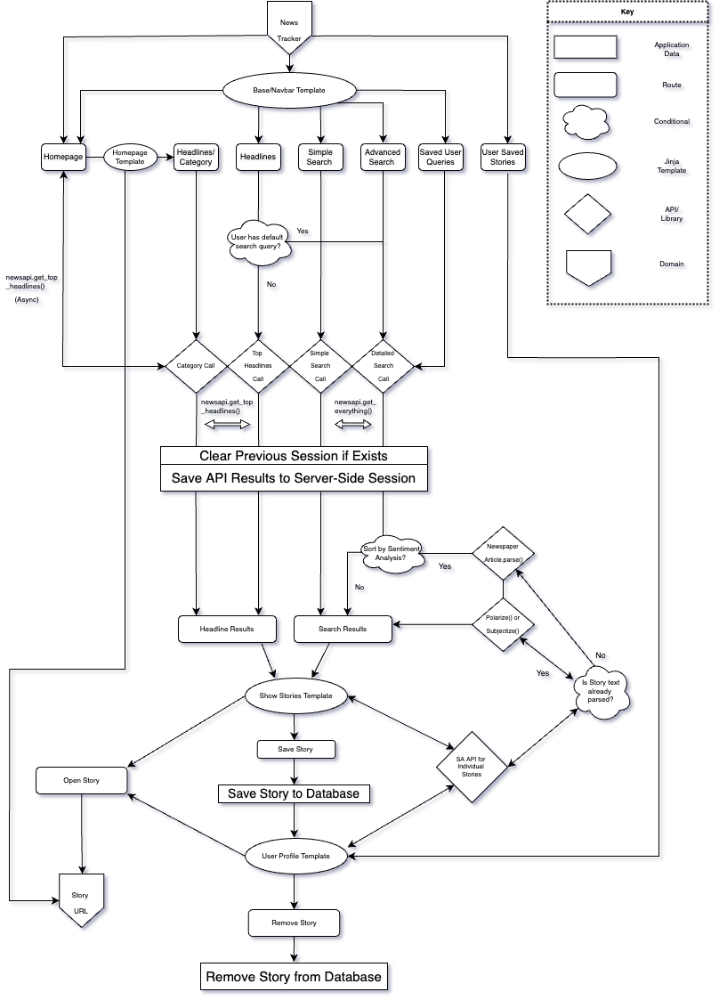

After extracting the resulting data from the api, the data is saved to Flasks's Server-Side Session, configured using a Redis database. This allows the results returned from the most recent request accessible globally within the app, and for each story to be assigned a unique data using Python's uuid(). This id is inherited as the primary key the story's Sqlalchemy object if it ends up getting saved by a user to our database. 

## Challenges/Reflections 
### Sentimental Analysis Accuracy
  Referring back to the [Purpose](#purpose) section of this document, the target demographic of this application may be broken down into two types of people: Investors; as laid out in scenarios 1 and 3, and News Consumers, as laid out in scenarios 2 and 4. Let's first take a look at how newstracker's polarity feauture might be more or less useful for investors vs consumers of news. 
  #### Polarity
  Generally speaking, polarity results are probabilistically more likely to be useful for investors as opposed to politically active news consumers. This is because investors have a much more straightforward relationship with the companies they search for in that *news that is good for the company is good for them, and news that is bad for the company is bad for them*. A notable exception would be if an investor is shorting a company, to which the inverse of the above relationship can simply be applied. NLTK's Polarity analysis seems to do a decent job at recognizing when an advancement has been made by an organization or individual; whether its expansion, deals, agreements, the announcement of new services, etc. It also does a fair job at detecting when an organization or individual has experienced some sort of threat or loss. This is great if we're just dealing with investors, who hold the simple relationship with the topic of their search (likely to be a company or CEO) where good news from that specific keyword tends to signal a greater return on investment. 
  
  However, polarity becomes much more complex when the user is searching from the perspective of a politically-minded individual with a specific set of nuanced beliefs. For some, a story with the headline "Russia on the verge of running out of soldiers" would be considered "good news", for instance, but actually ends up being classfied as "Negative" because Russia, the subject and likely keyword of the story, is itself experiencing something negative. As is the case with politics, the failures of an enemy are often victories for a particular cause or individual. When viewed from the politically agnostic perspective of NLTK's polarity library, any positive 
advancement or progress is viewed as positive. News events such as the passing of legislation are frequently intepreted as positive, even though the polarity of such things are entirely dependent on the values and beliefs of a particular user. Therefore, while the 4th scenario outlined in the [Purpose](#purpose) section might be somewhat useful, the subjective values of a user is simply too great of a factor to be ignored, making this usecase not all that attractive. 

Something that might help remedy this problem would be to collect data on a user either through a survey, or allowing them to rate the accuracy of polarity results according to their taste, and adjust the polarity calculation of new stories accordingly. Although I think this is a fascinating problem, it's currently above my skillset to attempt to implement. If any readers know of any existing libraries, projects, or resources that might address these sorts of issues, do feel free message me! 

    
  #### Subjectivity
  The accuracy of Textblob's subjectivity library is a bit more difficult to determine compared to NTLK's polarity library. For polarity analysis, our method of choice for checking if an output is accurate has been to hold it up against our own understanding of whether a story is positive or negative. It's a lot easier to look at an article (often just the headline is needed), absorb its semantic content, and determine if its a positive or negative development than it is to read an entire article and try to evaluate on our own where it lies on the spectrum of subjectivity. Because of this additional complexity, I personally haven't spent too much time assessing the accuracy of the app's subjectivity analysis at this point. It would be interesting to incorporate external projects and resources such as [Ad Fontes](https://adfontesmedia.com/) and [Media Bias/Fact Check](https://mediabiasfactcheck.com/reuters/) and evaluate how they compare to a macro-analysis of newstracker's subjectivity scores. 

However, it shouldn't be forgotten that these NLP libraries are only capable of assessing how subjective the tone of a text is. An article could be littered with tons of false information, that if written in an objective tone without the use of subjective embellishments, would probably be classified as objective. The knowledge itself that these sorts of situations exist already somewhat hinders use cases #1 and #2. I'm inclined to categorize the situation where an article is written using false information stated as facts as more of an edge case that one should be aware of, rather than an instand disqualifier for the sort of utility described in scenarios #1 and #2. Any suggestions or resources that could be useful in evaluating the accuracy of Textblob's subjectivity library and how it can be applied to the usecases I've described is certainly welcome!

### Limitations of NewsApi's Free Tier
#### Problem: Inability to access a story's full content.
  The free version of news API does not allow developers to access the entirety of a story's content, only providing the first few sentences. This is a huge problem for our app, since one of the key features we've imagined is to perform sentimental analysis on the body of each article, not just the headline or a few sentences! 
  
#### My Solution: Webscape from URL 
  Although we peasants don't have access to the article's body through NewsApi's free tier, we *are* given the URL, through which we can access an article's body by sending an HTTP request to the url and extracting the full content from the HTML, otherwise known as web-scraping. The only problem (and it's a big one) is that a web-scraper needs to know where it can expect to find the content to extract (ei, a div with an id of x) which would be an extremely difficult task given that we are dealing with dozens of news sources, each with their own uniquely structured html layouts. This is where the [Newspaper](https://newspaper.readthedocs.io/en/latest/) Library comes in. Sends a request to a given url and is able to parse the actual content of the article, regardless of the source, with surprising accuracy, rarely including "junk" content such as ads, comments, etc. Frankly, I don't have much of an idea how the underlying mechanics of this library works. Although not 100% perfect, it performs accurately enough for the purpose of this app, and is our magical little solution to address this issue of dynamic webscraping. 
  
#### Problem: Multiple consecutive HTTP requests for each story drastically increases user wait time. 
But wait! Now that we've decided that we're going to retrieve a story's full content by webscraping each URL, we've introduced a new problem. Each time we want to access full content from a single news story, we have to wait for a full "Request-Response" cycle to be completed. Just a single one can sometimes take several seconds! How are we going to provide an enjoyable user experience if a user is forced to wait between 10-30 seconds or more each time they want to search using a sentiment analysis filter?

#### An Inadequate Solution: Limit the # of stories that can be requested. 
Obviously, the more URLs that we have added to our list of requests to make, the longer it will take to render results to the user. NewsApi defaults to retrieving 100 different stories, which would result in astronomically long wait times up to several minutes. We can remove the situation where a user is unsure whether or not progress is being made by ensuring that the number of requested stories is limited by capping the number of results that can be returned. 

#### A Better Solution: Multiprocessing.
Asyncronous code in Python seems to be a bit more complicated than in Javascript, and the number of options out there to implement parallel code is a bit overwhelming for someone like myself who is a relative beginner. However, I was able to come across a quick and clean way to reduce the total amount of time needed by using Python's [multiprocessing library!](https://docs.python.org/3/library/multiprocessing.html) We import the `Pool` object from the multiprocessing library and instantiate it with a numerical value that represents the number of worker processes. We can then call its .map() method which allows an iterable to be passed as the second arguement and for each of these elements to be passed into the function in the first argument. .map() blocks the main program and maintains the same order, although this doesn't matter to us as we will reorder the list anyway after we have obtained our sentiment analysis results. The callback function that we've given to .map() as its first argument contains all the logic that we need to parse an article with Newspaper given its url. 
This solution made a huge difference in increasing overall speed, although I have a hunch that I could implement an even more efficient solution if I understood Multiprocessing and Multithreading in Python more deeply. This is definitely an area that I intend to research further. Incidentally, this same logic is also used when making the six separate request to NewsApi when getting the top headlines for each category on the homepage. 

### Storage and State Deliberations: Postgres VS Client-Side Session VS Server-Side Session
#### Problem: Temporarily storing search results in our database isn't very efficient, but data is too large to be handled using cookies.
I had original stored each story result from the API in the Postgres db  (to be deleted the next time a query is made) because there wasn’t enough space to store them Flask’s (Client-Side) Session, the advantage of the constraints defined in the database scheme making it harder to accidentally create stories that would result in errors elsewhere in the app, and to ease the development process as all instances of a story would be represented exactly the same way. I had also intended for users to be able to view history, which would have required that each story that showed up in a users search results be saved to the db as a story object and associated with that particular user. 
However, further along in my software development journey, I started understand and think more deeply about performance and scalability, and realized that storing every single story in my Postgres Database *probably* wasn't the most efficient way to handle the data. 

#### Solution: Flask's Server Side Session.
Server-side session solves this. Server-Side Sessions can be configured using a database, preferrably one where data is stored in memory rather than disk, such as Redis and Memcached to offer the similar perfomance improvements and ease of use that client side session uses, but with the added benefits of extra storage size and security. 

**Storage**: Server-Side Sessions offer more storage size simply by storing the data on the server it is hosted on, rather than using cookies exclusively, which only permit a maximum file size of 4KB. It still has to create cookies, because it's representing a session for a particular user. The difference is, instead of storing the data in the cookie, server-side sessions simply store ids as cookies. These ids are subsequently used by flask to query the database and get the data from the session. This has the added benefit of making the information provided by the client much more secure. Let's go into this in a bit more depth. 

**Security**: Regular client-side sessions use base-64 encoding. This is different than encryption. Allow the text in the developer tools in the browser is not readable by the user, all one would have to do to decode such information is to paste the encoded text into a base64 decoder, [of which there are many publicly available](https://www.base64decode.org/), and anyone can read the information stored. 

With server-side sessions, information is stored on the server. Therefore, the information will be just as secure as the server itself. 

Obviously, in the case of this project, the search results of news stories aren’t exactly sensitive information. Regardless, I believe this is very important to be aware of and something that I personally wasn’t aware of when I first started using flask sessions. 

**Speed**: From the official Redis website:
`Redis is an open source (BSD licensed), in-memory data structure store, used as a database, cache and message broker.` 
Databases such as Redis and Memcached support sub-millisecond response times. 
By storing data in-memory they can read and write data more quickly than disk based databases. In some situations, [Redis has reportedly performed at up to 16 times the speed of a Postgres database.](https://www.peterbe.com/plog/redis-vs-postgres-blob-of-json) 

#### Problem: Complications Changing Sqlalchemy logic to Session logic.
Now that the stories returned by the search results are stored in session, the question of how to connect user interactions with each story presents itself (clicking get pol, get sub buttons, saving story, removing story, etc). Previously, each story had its own unique id autoincrementing as the primary key, and was fairly easy to access handle.

#### Solution: Generate keys using uuid.
To remedy this, we create our random keys using uuid() to assign to each story as represented a dictionary in session. 

#### Problem: Data relative to each story is going to be stored differently depending on where we are in the app.
For example, story data from a user’s saved stories will be stored in the database, whereas search results and headlines will be stored in session. 

#### Solution: Have SQLalchemy objects inherit uuids as primary key when created. 
To remedy this, I made sure that SQLAlchemy objects and session dictionaries contain the same exact data. When the SQLAlchemy objects are created, the inherit the session ID generated by uuid as the primary key. Since these keys are 10 digits, it is extremely improbable that the same random id would be generated twice. If this application was actually widely used, I would probably implement some logic to call uuid() recursively if we get a SQLAlchemy error of violating the unique key restraint. 

## Future Ideas
### Automatic Sentiment Analysis Scores for User Search Queries
In order to further optimize user experience, we could save the user some time by automatically running sentiment analysis on each topic that they have saved in their search queries, and display the average score associated with each query in their "My Queries" tab. This could save a ton of time and effort for a user whose primary concern is the average sentiment analysis of a particular topic, rather than getting results story-by-story. Messaging services could also be added to sent texts or emails to users alerting them of drastic shifts in sentiment. 

### Macro-Analysis
API requests could be scheduled using a chron scheduler to analyse as many breaking news stories as possible per day. Trends within companies, industries, countries, individuals, etc could be identified throughout time. For example, it might be interesting to be able to determine what company received the most positive press per a given year. Or which news source scored the highest or lowest in terms of subjectivity. A new SQL table confined only to the columns of sentiment analysis scores and keywords in order to save database memory. We could even narrow it down further by only storing the keyword/source, average score, and number of stories/scores that have been included in the average score. Each time a new story containing the keyword/source enters our app through an api call, we would simply calculate a new average and increment the quanitity of stories associated with the keyword/source by 1. 

### Integration of Twitter API
Twitter's API could provide users the ability to digest information in bite-sized pieces, and could be incorporated into the weighting of sentimental analysis. Twitter's API offers the content of a tweet in its http resonses, so there wouldn't be any need to implement webscraping and run parallel requests as was needed with news-api. Additionally, visual representations of such insights could be useful to investors, marketers, etc, and provide the user with a more enjoyable experience. 

### React.js Front-End
If I could build this app again from scratch, I would definitely include a front-end framework in order to make it more responsive and more efficiently re-use the same pieces of html and css. I chose to work the Jinja templates originally because I hadn't yet been introduced to React in my course. For the most part, Jinja works just fine with news tracker, but there are some pieces in particular that I find myself really wishing I was working with a front-end framework. For example, the detailed search form could be less cluttered if it was more responsive. 

  

