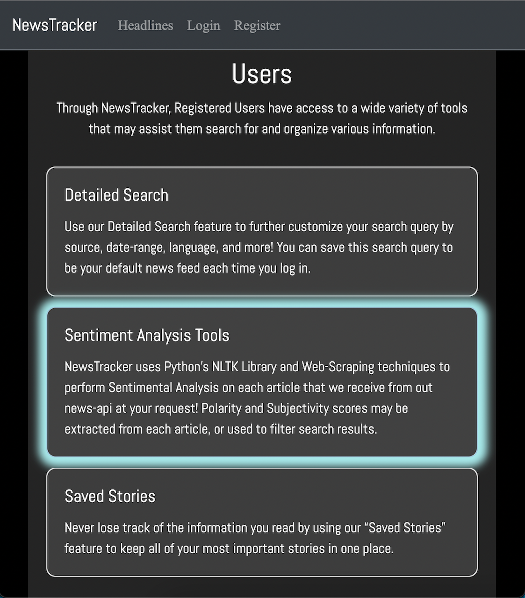

# newstracker

## Technology/Tools: 
Python, Flask, SQLAlchemy, Redis, NewsAPI, NLTK, Newspaper, Axios, WTForms, CSS, Bootstrap,

## Summary: 
  NewsTracker is an application designed to enhance and optimize the way a user interacts with news stories. 
  This is achieved primarily using a search engine that connects to [NewsAPI](https://newsapi.org/) which allows the user to narrow-down the content of their results.  
  Additional search parameters such as [Polarity](https://www.nltk.org/api/nltk.sentiment.html) and [Subjectivity](https://www.topcoder.com/thrive/articles/getting-started-with-textblob-for-sentiment-analysis#:~:text=Subjectivity%20is%20the%20output%20that,%2C%20WordNet%20integration%2C%20and%20more.) use Natural Language Processing through Python's [NLTK](https://www.nltk.org/) and [Textblob](https://textblob.readthedocs.io/en/dev/) libararies to parse through 
  the html data given by the URL returned by NewsAPI, which will order a user's search results by the degree to which an article is objective or positive, 
  as well as attach specific Sentimental Analysis data to each story.
  
  Other features available to users include the ability to save stories that they want to refer back to later, save multiple search queries for easy-access through an accordian drop-down, and the ability to set one of said queries as a user's default so that their headline feed will be base its results off that query
  default so that the main headline page will show results based off of the user's default search query. 

## Purpose: 
  The ability to run an advanced search query to display a specific type of story and store it permanently in a user's account could be beneficial for 
  anyone wanting to keep up with current events and/or investment opportunities. Getting Sentimental Analysis prior to reading a story has a variety of potential 
  benefits. Imagine the following scenarios:

    1) An investor is trying to assess the pros and cons of owning stock in a particular company. Using the
    subjectivity feature to identify degrees of subjectivity, they may choose to filter out articles that are
    marked as highly subjective, which allows them to save researching time and become better informed.

    2) Someone wanting to become more politically informed about a particular issue may use the subjectivity 
    feature to identify news sources and types of stories that may not be worth reading due to the degree to
    which the author's tone skews from being objective. 

    3) A day/swing trader may want to use the polarity feature to evaluate the overall market sentiment of a
    particular stock, crypto, or geo-political region. 

    4) An individual has been feeling that the amount of negative news they've been consuming has taken a toll
    on their mental health, and want to expose themselves to more positive and uplifting news may use the polarity 
    feature to filter out negative stories. 

  As you can see, there are many potential use-cases for NewsTracker that will only continue to increase as more features are added. I would note, however, 
  that NLTK's Sentimental Analysis features are not perfect, and a user should not expect to get accurate results or insights 100% of the time. 

## User-Flow: 
  The homepage of NewsTracker contains an easily accessible Demo User login button on the top right of the page, which allows a visitor to access the same feautures as a real user. The page as a whole contains cards on the left side explaining various features of the app,
  while the right side contains multiple Bootstrap carousels
  containing the top headlines for each category permitted to us by the News Api.  Clicking on each story as they pass through the carousel results 
  in said story opening up in a new window, while clicking the category name itself returns a feed of headlines containing the stories displayed in the carousel.  
  
  
  
  A user can use the links in the navbar to log-in or register. After which, they will be redirected to a feed of headlines (*referred to as "Headlines" in the navbar*)
  or a feed displaying results from their default search query, if previously selected. 
  
  Now that a user is logged in, they may want to user features of the application only available to users, such as the Advanced Search feature (*"Detailed Search" in 
  the navbar*) or refer to previous saved stories (*"My Stories" in the navbar*).
  
  Along with the option of filtering one's search results by polarity or subjectivity, a user may choose to get such sentimental analysis data on any individual stories
  wherever they are rendered, with the exception of the category-carousels on the home-page. 
 
## Data: 
### Storage
#### Postgresql/Flask-SqlAlchemy

  News Tracker uses a Postgresql database configured through Flask-Sqlalchemy on the backend to store information that we want to persist in our application regardless of the client. When reduced to the absolute minimum amount necessary, we are left only with information pertaining to a registered user. This includes the information given by a user upon registration, as well as stories and search queries that they may have saved. In SQL terms, we are left with a simple schema containing 3 tables: User, Story, and Query, where Story and Query are associated with their respective user by a foreign key in a one-way, one-to-many relationsip.
A diagram of our Postgresql schema is shown below. 
  
  

  Data that doesn't need to persist, in our case being regular search queries and search results that a user does not choose to save, are temporarily stored memory with Flask's Server-Side Session configured through a Redis database. By taking the approach of avoiding using our Postgresql database except when absolutely necessary, we reduce latency and increase overall permformance. A more in depth explanation discussing the trade-offs of using Posgresql, Server Side Session, and Client Side Session for this project can be found below. 
  
 

  
  Data for individual news stories is sent to the app via one of the two endpoints that NewsApi provides; Get Top Headlines, and Get Everything. Get Everything is the more customizable endpoint, with a sizable amount of different parameters, many of which are utilized in News-Tracker's advanced search. Get Top Headlines, on the other hand, only allows language and category as its parameters. Both are used at various points throughout the app. The diagram below illustrates the directional flow of information and data as it travels throughout the application.

A helpful way to conceptualize this process is to think of all api requests generated by user input will end up calling the Get Everything endpoint (essentially all 'searches') whereas all api requests simply wanting to get the top stories for everything or by category will call the Get Top Headlines endpoint. 

After extracting the resulting data from the api, the data is saved to Flasks's Server-Side Session, configured using a Redis database. This allows the results returned from the most recent request accessible globally within the app, and for each story to be assigned a unique data using Python's uuid(). This id is inherited as the primary key the story's Sqlalchemy object if it ends up getting saved by a user to our database. 

## Challenges: 
  The free version of news API is only limited to 100 requests per day, and does not allow developers to access the entirety of a story's content. As a work-around, I've used the "Newspaper"
  parsing library in python to extract the actual content of a story by making a request to the story's URL given to us by the NewsAPI. As a downside, each time sentimental analysis data
  is being parsed, a separate HTTP request is made. This is not so problematic when SA data is being requested by the user for one particular story, but does cause less than ideal waiting
  times for a user that has entered a search query requesting the results to be sorted by polarity or subjectivity. Because of this, I've temporarily limited the amount of results that are able to be
  requested in the advanced search feature to 10 until I've added a progress window to set the user's mind at ease, as well as more logic to the form itself that warns the user of the time it may
  take to initiate such a query.
  
  
  
